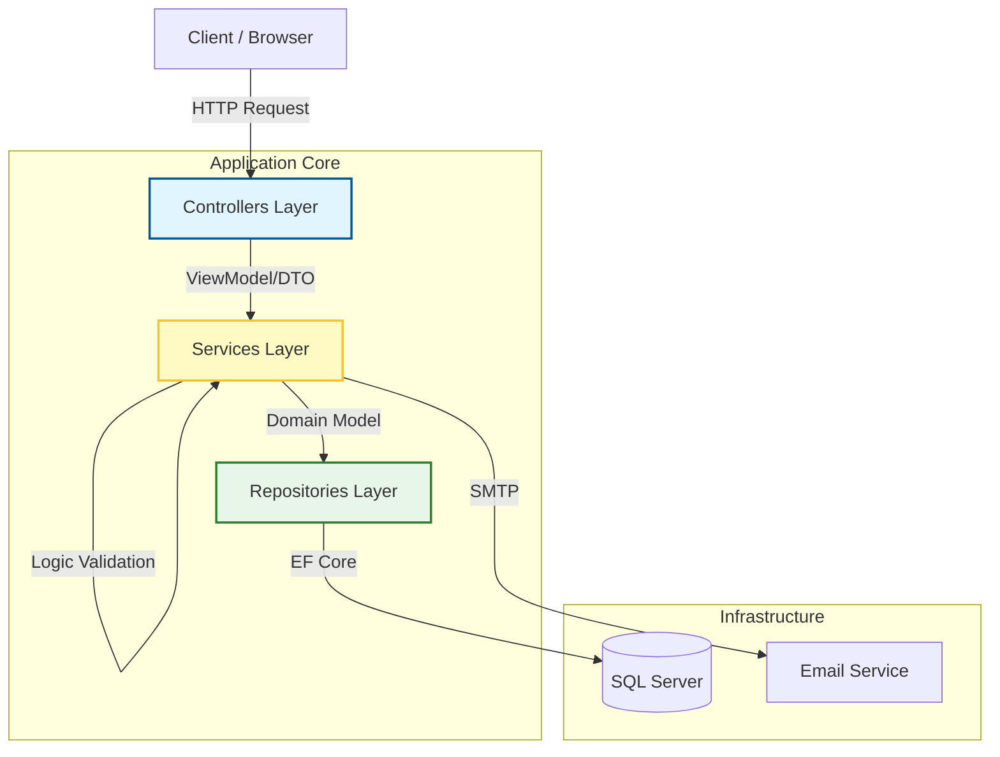

# 🛒 TechZone E-commerce Platform

TechZone là một nền tảng thương mại điện tử hiện đại, mạnh mẽ được xây dựng trên ASP.NET Core MVC. Dự án tập trung vào trải nghiệm người dùng mượt mà (Live Search, Filter) và độ tin cậy của dữ liệu (Transaction Management) trong quy trình đặt hàng.

# 📖 Giới thiệu (Introduction)

Dự án này mô phỏng quy trình kinh doanh thiết bị công nghệ. Hệ thống được thiết kế với kiến trúc phân lớp (N-Layer Architecture), tách biệt rõ ràng giữa giao diện, xử lý nghiệp vụ và truy cập dữ liệu, giúp dễ dàng bảo trì và mở rộng.

Điểm nổi bật của dự án là khả năng xử lý đồng bộ dữ liệu chặt chẽ: từ việc kiểm tra tồn kho, trừ kho, tạo đơn hàng đến gửi email xác nhận đều được quản lý trong một Transaction đảm bảo tính toàn vẹn (ACID).

# 🚀 Tính năng chính (Key Features)

## 🛍️ Trải nghiệm Mua sắm (Storefront)

Tìm kiếm thông minh (Live Search): Gợi ý sản phẩm ngay lập tức thông qua API và AJAX khi người dùng gõ từ khóa.

Bộ lọc nâng cao: Lọc sản phẩm đa chiều theo Danh mục, Thương hiệu, và các thuộc tính động (RAM, CPU, Màn hình...).

Chi tiết sản phẩm: Hiển thị thông số kỹ thuật, hình ảnh, sản phẩm liên quan.

## 🛒 Giỏ hàng & Thanh toán (Checkout Flow)

Persistent Cart: Giỏ hàng được lưu trữ trong Database, đồng bộ hóa trạng thái trên mọi thiết bị của người dùng.

Transaction Safety: Sử dụng Database.BeginTransactionAsync để đảm bảo quy trình: Trừ tồn kho -> Tạo đơn hàng -> Xóa giỏ hàng diễn ra nguyên vẹn hoặc rollback nếu có lỗi.

Email Notification: Tự động gửi Email xác nhận đơn hàng (HTML Template) qua SMTP Google.

## 🌟 Đánh giá & Cộng đồng (Reviews)

Verified Purchase Logic: Hệ thống chỉ cho phép người dùng đánh giá sản phẩm khi họ đã mua và đơn hàng thành công.

Rating Statistics: Tự động tính toán điểm trung bình và phân bố sao (1-5 star) cho từng sản phẩm.

## 🛡️ Bảo mật & Quản trị (Security)

Authentication: Sử dụng ASP.NET Core Identity để quản lý người dùng.

Security Best Practices: Chống CSRF (ValidateAntiForgeryToken), SQL Injection (thông qua EF Core Parameterization).

# 🏗️ Kiến trúc hệ thống (Architecture)

Dự án áp dụng mẫu thiết kế Service-Repository Pattern kết hợp với Dependency Injection (DI).



### Mô tả:

Controllers: Tiếp nhận Request, Validate ModelState, gọi Service và trả về View/JSON.

Services: Chứa toàn bộ Business Logic (ví dụ: OrderService tính toán tổng tiền, gọi EmailSender, điều phối Transaction).

Repositories: Chỉ chịu trách nhiệm CRUD với Database, không chứa logic nghiệp vụ phức tạp.

# 🛠️ Cài đặt & Chạy dự án (Installation)

## Yêu cầu tiên quyết (Prerequisites)

.NET 8.0 SDK

SQL Server (LocalDB hoặc Full instance)

Visual Studio 2022 hoặc VS Code

## Các bước cài đặt

## Bước 1: Clone Repository
```bash
git clone [https://github.com/duyhub103/MyWeb.git](https://github.com/duyhub103/MyWeb.git)
cd MyWeb
```

## Bước 2: Cấu hình Môi trường
Mở file appsettings.json và cập nhật chuỗi kết nối Database và thông tin Email:
```bash
{
  "ConnectionStrings": {
    "DefaultConnection": "Server=.;Database=TechZoneDb;Trusted_Connection=True;MultipleActiveResultSets=true;TrustServerCertificate=True"
  },
  "EmailSettings": {
    "Host": "smtp.gmail.com",
    "Port": "587",
    "Email": "your-email@gmail.com",
    "Password": "your-app-password" 
  }
}
```
> Lưu ý: Mật khẩu email phải là "App Password" nếu bạn dùng Gmail xác thực 2 bước.

## Bước 3: Khởi tạo Database
```bash
Chạy lệnh sau để áp dụng Migrations và tạo Database:
dotnet ef database update
```
## Bước 4: Chạy ứng dụng
```bash
dotnet run
```
Truy cập ứng dụng tại: https://localhost:7087 (hoặc port hiển thị trên terminal).

# 📂 Cấu trúc thư mục (Folder Structure)

Dưới đây là sơ đồ chi tiết các thành phần quan trọng trong dự án để bạn dễ dàng nắm bắt luồng hoạt động:
```bash
MyWeb/  
├── Controllers/                  \# Điều phối luồng (Request handling)  
│   ├── AccountController.cs      \# Đăng nhập, Đăng ký, Logout  
│   ├── CartController.cs         \# Thêm/Sửa/Xóa giỏ hàng (AJAX)  
│   ├── CheckoutController.cs     \# Quy trình đặt hàng & Thanh toán  
│   ├── ProductController.cs      \# Hiển thị, Tìm kiếm, Lọc sản phẩm  
│   └── HomeController.cs         \# Trang chủ, Banner, Tin tức  
│  
├── Services/                     \# Xử lý nghiệp vụ (Business Logic)  
│   ├── Implementations/  
│   │   ├── OrderService.cs       \# Transaction: Trừ kho \-\> Lưu đơn \-\> Gửi mail  
│   │   ├── ProductService.cs     \# Logic tìm kiếm, tính toán sao đánh giá  
│   │   ├── CartService.cs        \# Tính toán tổng tiền, phí ship  
│   │   └── EmailSender.cs        \# Cấu hình SMTP gửi mail  
│   └── Interfaces/               \# Định nghĩa Interface cho DI  
│  
├── Repositories/                 \# Truy cập dữ liệu (Data Access)  
│   ├── Implementations/  
│   │   ├── OrderRepository.cs    \# Thực thi Transaction SQL  
│   │   ├── ProductRepository.cs  \# Query lọc sản phẩm nâng cao (LINQ)  
│   │   └── ...  
│   └── Interfaces/  
│  
├── Models/                       \# Database Entities (EF Core)  
│   ├── Product.cs  
│   ├── Order.cs  
│   ├── Cart.cs  
│   └── ApplicationUser.cs        \# Extension của IdentityUser  
│  
├── ViewModels/                   \# Data Transfer Objects (DTOs)  
│   ├── CheckoutViewModel.cs      \# Dữ liệu cho trang thanh toán  
│   ├── ProductDetailViewModel.cs \# Dữ liệu phức hợp cho trang chi tiết  
│   └── ...  
│  
├── Views/                        \# Giao diện người dùng (Razor Pages)  
│   ├── Shared/                   \# Layout, Partials (Header, Footer)  
│   └── ...  
│  
├── wwwroot/                      \# Static Files  
│   ├── css/                      \# Stylesheets (SCSS compiled)  
│   ├── js/                       \# Client-side logic (Cart AJAX, validation)  
│   └── images/                   \# Product images & Banners  
│  
└── Program.cs                    \# App Entry Point & DI Configuration
```
# 🖼️ Hình ảnh Demo (Screenshots)

## 👉 Để xem chi tiết giao diện và các màn hình chức năng, vui lòng xem tại: [Views/README.md](Views/README.md)


Developed by [duyhub103](https://github.com/duyhub103/MyWeb)