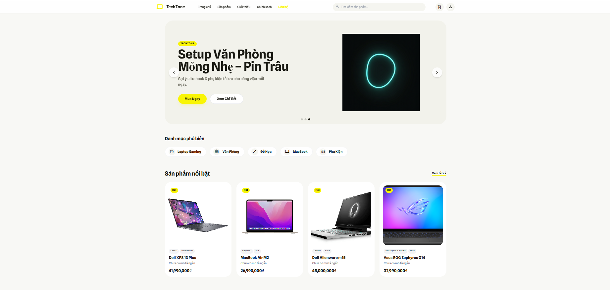
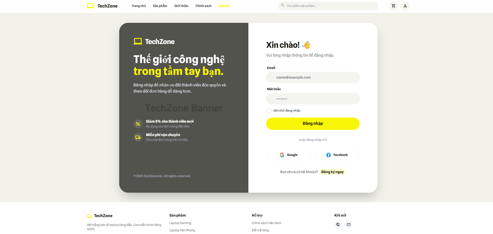
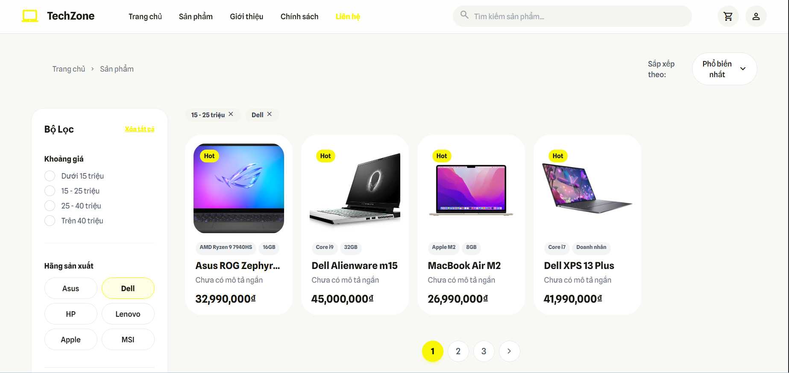
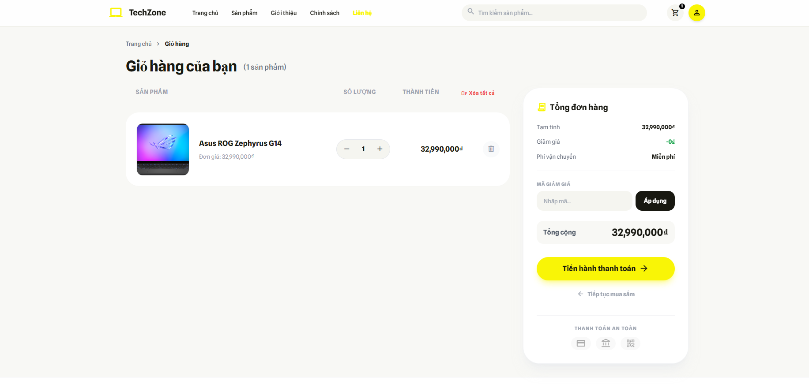
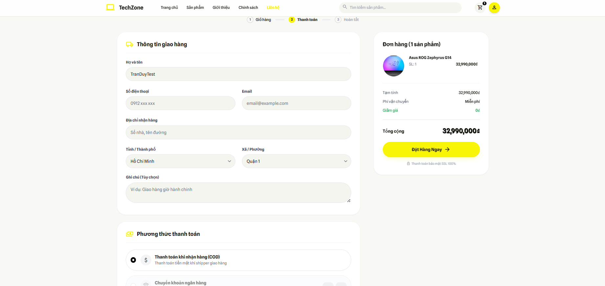

# 🎨 TechZone UI/UX Documentation

Tài liệu này mô tả cấu trúc giao diện (Front-end) và các màn hình chính của ứng dụng TechZone.

# 📂 Cấu trúc thư mục Views

Thư mục Views chứa toàn bộ các file giao diện .cshtml (Razor Views) được chia theo Controller.
``` bash
Views/
├── Account/            # Các trang Đăng nhập, Đăng ký
├── Cart/               # Giỏ hàng
├── Checkout/           # Trang Thanh toán
├── Home/               # Trang chủ, About, Contact
├── Product/            # Danh sách sản phẩm, Chi tiết, Tìm kiếm
├── Shared/             # Các thành phần dùng chung (Layout, Header, Footer)
│   ├── _Layout.cshtml  # Layout chính
│   ├── _Header.cshtml  # Thanh điều hướng (Navigation)
│   └── _Footer.cshtml  # Chân trang
└── demo-images/        #
```

# 📸 Demo Screenshots

## 🏠 Trang chủ (Home)

Giao diện chính hiển thị Banner, Sản phẩm nổi bật và Danh mục.



## 🔐 Đăng nhập & Tài khoản (Login)

Màn hình đăng nhập dành cho thành viên.



## 📦 Danh sách / Chi tiết sản phẩm (Detail)

Hiển thị thông tin chi tiết, thông số kỹ thuật và đánh giá.



## 🛒 Giỏ hàng (Shopping Cart)

Quản lý các sản phẩm đã chọn mua.



## 💳 Thanh toán (Checkout)

Quy trình nhập thông tin giao hàng và đặt hàng.

